<!--
  natishmourani/natishmourani — profile README

  portfolio.svg is embedded below as a picture, so any links drawn inside it
  are not clickable (see why-links-dont-work-SIMPLE.md for the full reason).
  The two rows underneath are plain Markdown links — real, clickable, and
  the only reliable way to make these reachable from the profile page.
-->

  

  <a href="https://github.com/natishmourani/HireSense-Resume-Matcher">HireSense</a> &nbsp;·&nbsp;
  <a href="https://github.com/natishmourani/DiaPredict-AI">DiaPredict AI</a> &nbsp;·&nbsp;
  <a href="https://github.com/natishmourani/Smart-Proctor-System">Smart Proctor</a> &nbsp;·&nbsp;
  <a href="https://github.com/natishmourani/CPU-Scheduling-Simulator">CPU Scheduling</a> &nbsp;·&nbsp;
  <a href="https://github.com/natishmourani/Convex-Hull">Convex Hull</a>

  📧&nbsp;<a href="mailto:natishmourani@gmail.com">natishmourani@gmail.com</a> &nbsp;·&nbsp;
  💼&nbsp;<a href="https://www.linkedin.com/in/natish-mourani-566949375/">LinkedIn</a> &nbsp;·&nbsp;
  📁&nbsp;<a href="https://github.com/natishmourani?tab=repositories">Repositories</a>

<!--
  ─────────────────────────────────────────────────────────────────────────
  Why these two rows exist (short version — full version in
  why-links-dont-work-SIMPLE.md):

  The  tag above renders portfolio.svg as a flat picture. Browsers can
  never click into a link that's drawn inside a picture — that's true on
  every website, not just GitHub. So any <a href> written inside the SVG
  itself is permanently unreachable from this page, no matter how it's coded.

  The two rows above are ordinary Markdown links sitting in the page itself,
  not inside the image. That's the only thing that makes them clickable here.

  Do not delete these rows again without adding a replacement — they are
  currently the only way a visitor to this profile can reach your email,
  LinkedIn, or repositories.
  ─────────────────────────────────────────────────────────────────────────
-->
